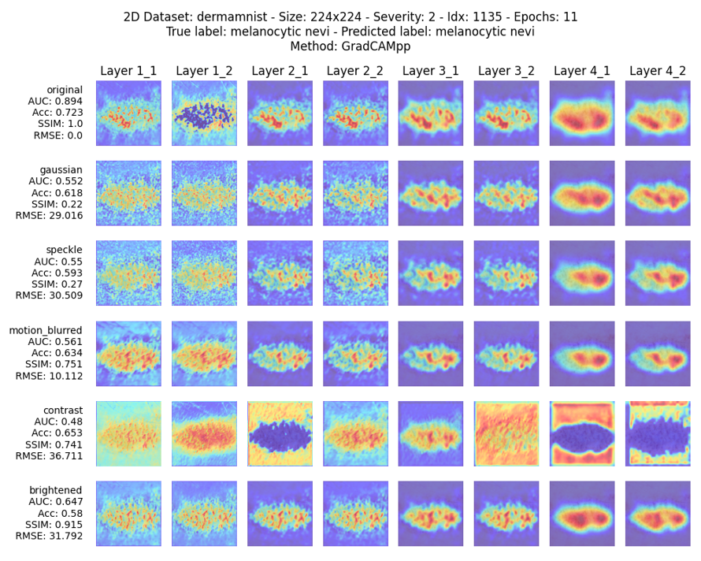

# Master's Thesis: Interpretability-based robustness analysis of medical image classification models.

This repository contains the implementation and analysis code for the thesis project titled "Interpretability-based Robustness Analysis of Medical Image Classification Models. This project is divided into two main parts:
1. The main code, which generates saliency maps and calculates metrics such as AUC and accuracy.
2. The generation of plots for the visualization of these metrics.

# Description
Medical image classification is a crucial component of modern healthcare, where accuracy, robustness, and interpretability of AI models are paramount. This thesis project investigates how different MRI sequence-specific image perturbations influence model performance and the potential for these perturbations to correlate with classification errors. By applying interpretability techniques such as saliency maps and analyzing their differences across perturbed and unperturbed images, the project aims to identify specific failure modes and improve the model’s reliability. The research utilizes the MedMNIST dataset, which is a combination of several medical imaging datasets. This comprehensive collection facilitates the evaluation of models across diverse clinical scenarios.




# Key Features
- **MedMNIST Dataset**: Use of the MedMNIST dataset, which is a combination of several medical imaging datasets, providing a diverse set of medical images for comprehensive model evaluation.
- **Data Augmentation**: Implementation of extensive data augmentation techniques, including Gaussian noise, motion blur, and contrast adjustments, to simulate different levels of perturbations on medical images.
- **ResNet18 Model**: Utilization of the ResNet18 architecture for medical image classification to leverage its deep residual learning capabilities for enhanced performance and robustness.
- **Generation of Perturbations**: Application of various perturbations to images to study their effects on model performance and robustness.
- **Model Interpretability**: Use of saliency maps to analyze the model's decision-making process and evaluate how perturbations impact the interpretability of the model.
- **Robustness Analysis**: Comprehensive analysis of model robustness through metrics such as Root Mean Squared Error (RMSE) and Area Under the Curve (AUC) across different perturbation severities.
- **Plotting and Visualization**: Generation of detailed plots and visualizations for metrics such as loss, accuracy, and perturbation effects, to facilitate the interpretation and analysis of model performance and robustness.


# Code Structure
* [`Project/`](Project/):
   * [`Plot/`](Project/Plot/):
       * [`data_processor.py`](Project/Plot/dataset.py): Prepares and processes data used by the plotting functions.
       * [`file_handler.py`](Project/Plot/file_handler.py): Handles file input/output operations, including reading and writing plot data.
       * [`plot_generator.py`](Project/Plot/plot_generator.py): Main script for creating and displaying plots based on processed data.
       * [`plotting.py`](Project/Plot/plotting.py): Supports plot generation by organizing and structuring plot configurations.
   * [`Saliency/`](Project/Saliency/):
       * [`__init__.py`](Project/Saliency/__init__.py): Initializes the Saliency module.
       * [`config.py`](Project/Saliency/config.py): Contains configuration settings and constants used throughout the project.
       * [`csv_manager.py`](Project/Saliency/csv_manager.py): Manages CSV operations, including saving and loading results.
       * [`data_augmentation.py`](Project/Saliency/data_augmentation.py): Implements data augmentation techniques for testing model robustness.
       * [`data_processing.py`](Project/Saliency/data_processing.py): Handles data loading, preprocessing, and transformations.
       * [`evaluation.py`](Project/Saliency/evaluation.py): Scripts for evaluating model performance on various datasets.
       * [`heatmap.py`](Project/Saliency/heatmap.py): Generates and processes heatmaps for interpretability and saliency analysis.
       * [`image_processing.py`](Project/Saliency/image_processing.py): Handles image transformations, processing, and preparation for analysis.
       * [`main.py`](Project/Saliency/main.py): Main execution script that orchestrates data loading, training, testing, and evaluation.
       * [`model_architecture.py`](Project/Saliency/model_architecture.py): Defines model architectures, including ResNet and other CNNs.
       * [`model_training.py`](Project/Saliency/model_training.py): Implements model training, validation, and early stopping logic.
       * [`utils.py`](Project/Saliency/utils.py): Provides utility functions for tasks such as memory tracking and time measurement.
       * [`visualization.py`](Project/Saliency/visualization.py): Tools for visualizing model interpretability results, such as saliency maps and heatmaps.


# Installation and Requirements
## Prerequisites
Before you can run the project, ensure you have the following installed:

- Python 3.8+
- tqdm
- opencv-python
- psutil
- numpy
- Pillow
- imgaug
- pandas
- torch
- torchvision
- matplotlib
- medmnist
- torchcam
- scikit-image

## Path Configuration
After installing the required libraries, you need to ensure that the paths used in the project are correctly set up. This is done in the config.py file, located in the Saliency/ directory.

1. Open the config.py file in a text editor.

2. Modify the path variables to reflect the correct directories on your system. For example:
```python
# Example path configuration in config.py
OUTPUT_DIR = '/path/to/output/directory'
DATA_DIR = '/path/to/data/directory'
MODEL_DIR = '/path/to/model/directory'
```

# Contribution
This project is part of a Master's thesis, but contributions and discussions are welcome. Feel free to open issues for any bugs or feature requests.

# License
The MedMNIST dataset is licensed under *Creative Commons Attribution 4.0 International* ([CC BY 4.0](https://creativecommons.org/licenses/by/4.0/)), except DermaMNIST under 
*Creative Commons Attribution-NonCommercial 4.0 International* ([CC BY-NC 4.0](https://creativecommons.org/licenses/by-nc/4.0/)).

